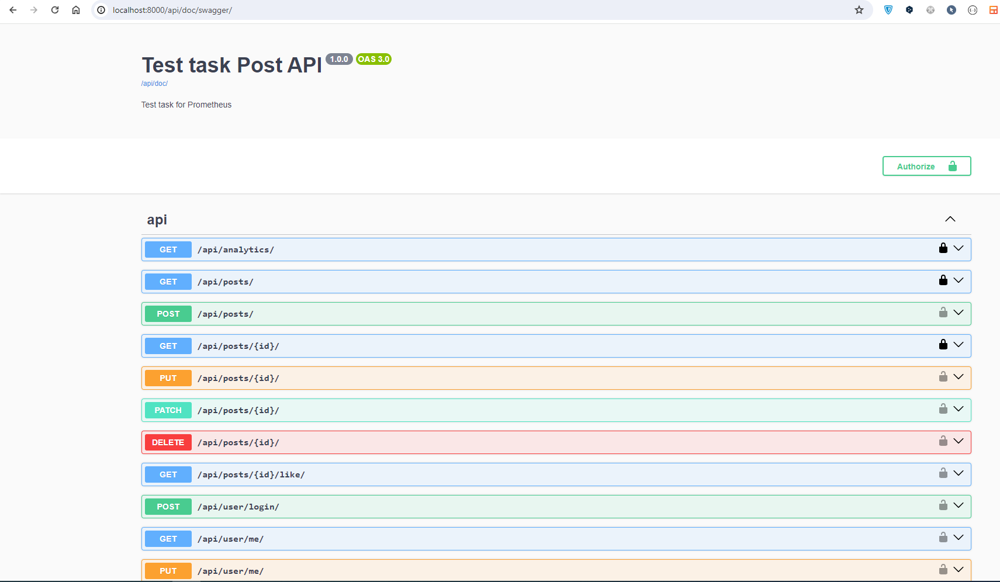
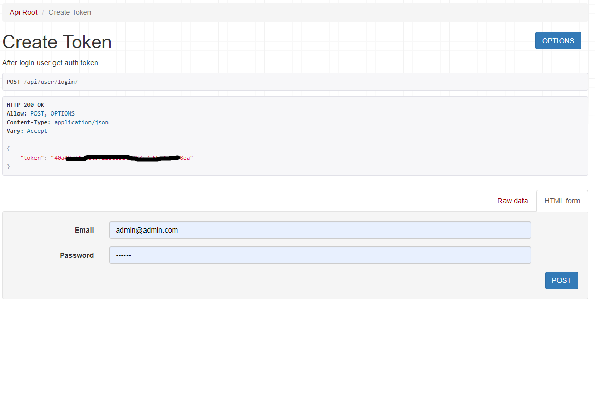
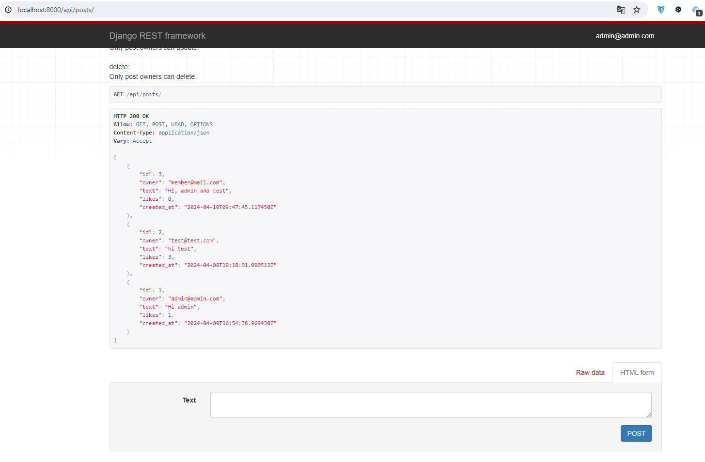
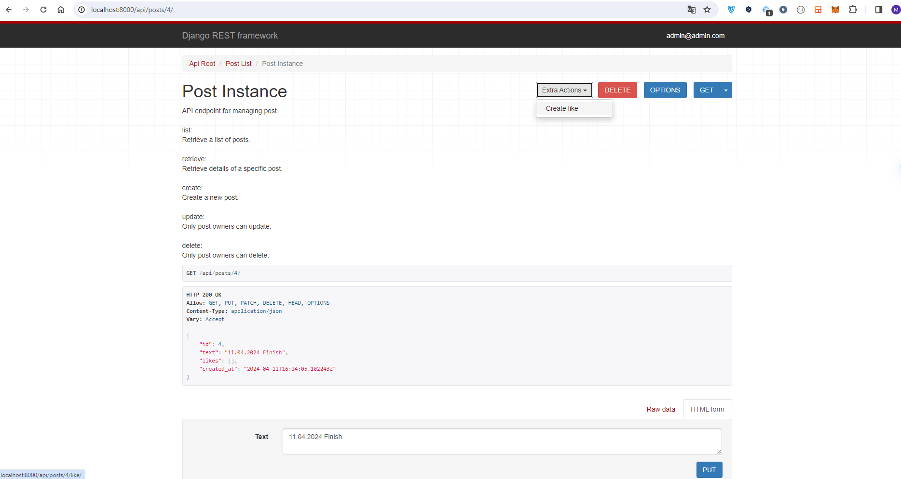
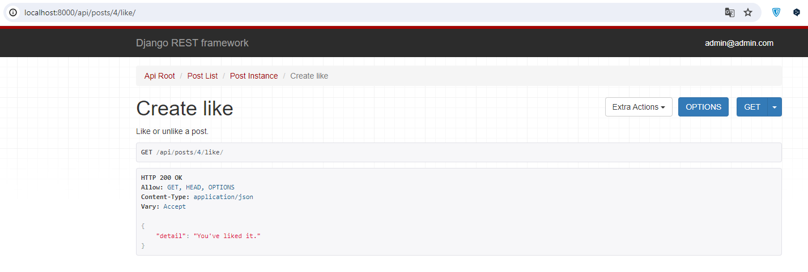
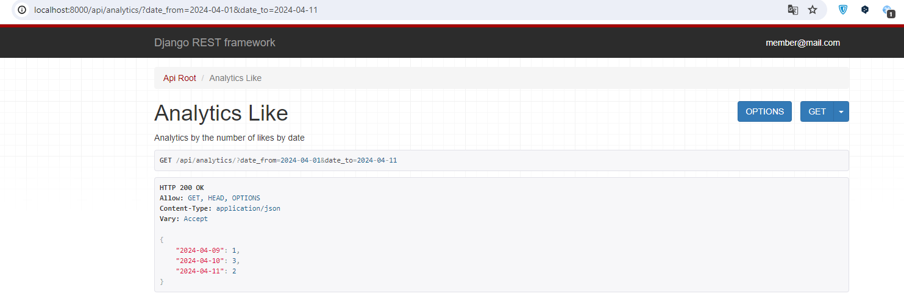

# test_task_prometheus
A simple RESTAPI app using the Django Rest Framework. For creating posts by users and getting likes. As well as getting analytics by day and number of likes. Authorization with tokens.

## Table of Contents
- [Introduction](#introduction)
- [Features](#features)
- [Installation Git](#installation)

## Introduction

Created using Django REST API as a test task.

### Features:
- Token Authentication
- Email-Based Authentication
- API documentation
- CRUD operations for post, like.
- Analytics of likes by day.

## Installation

1. Clone the repository:

   ```
   https://github.com/bezhevets/test_task_prometheus.git
   ```
2. Create .env file and define environmental variables following .env.example:
   ```
   SECRET_key=" your django secret key "
   ```
3. Create a virtual environment::
   ```
   python -m venv venv
   ```
4. Activate the virtual environment:

   - On macOS and Linux:
   ```source venv/bin/activate```
   - On Windows:
   ```venv\Scripts\activate```
5. Install project dependencies:
   ```
    pip install -r requirements.txt
   ```
6. Run database migrations:
    ```
    python manage.py makemigrations
    python manage.py migrate
    ```
___

## Screenshots:
### Swagger Doc /api/doc/swagger/

### Email login ant Token Authentication /api/user/login/

### Created post /api/posts/

### Post detail /api/posts/<id>/

### Post like/unlike /api/posts/4/like

### Analytics of likes by day api/analytics/?date_from=2024-04-01&date_to=2024-04-11



